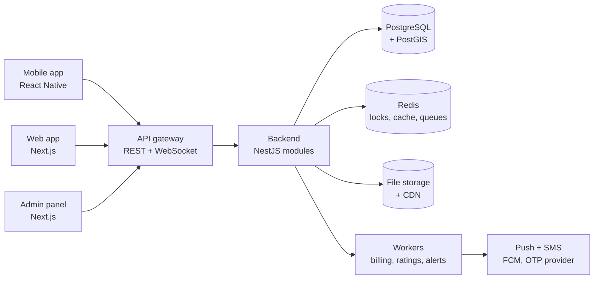
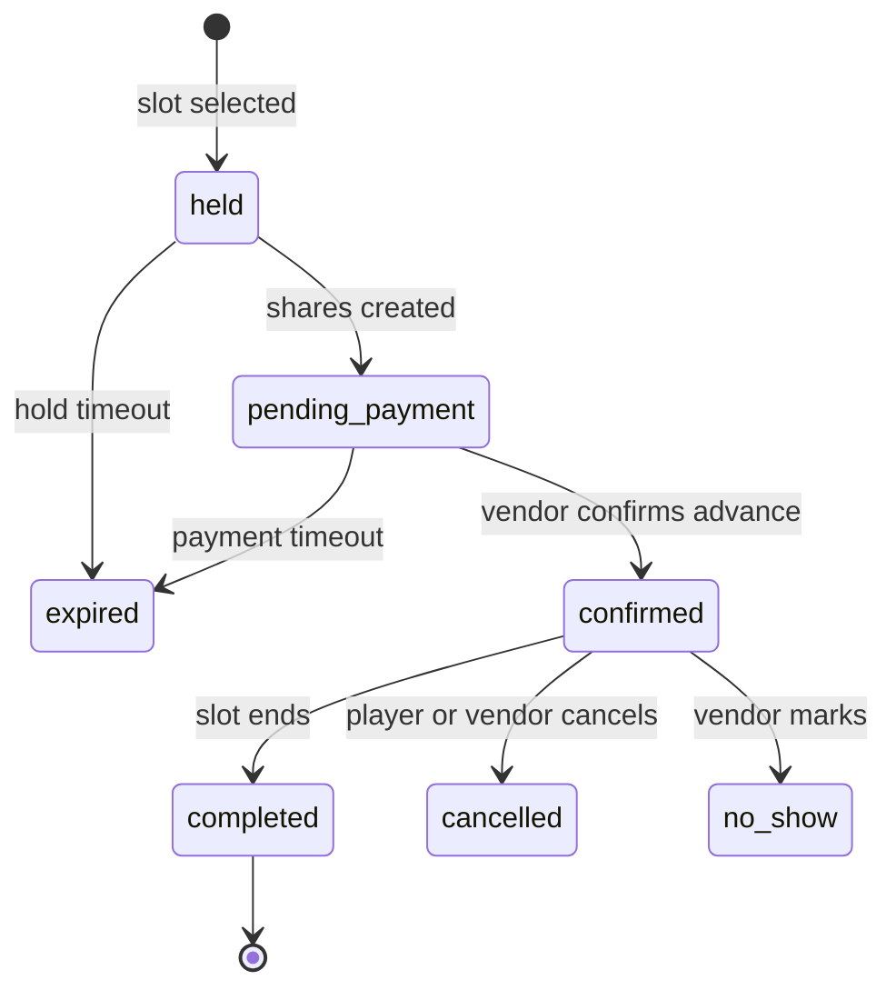
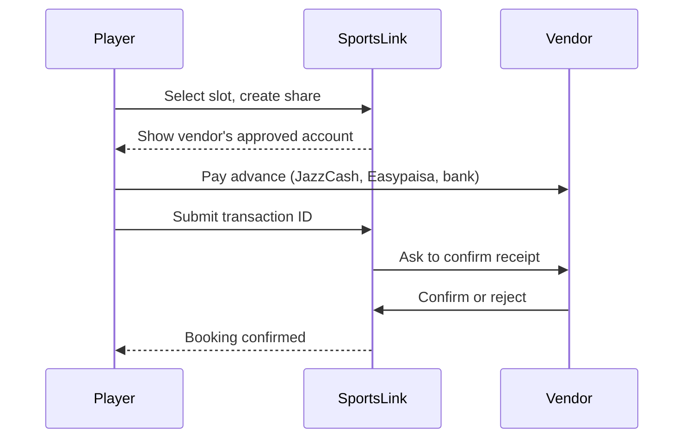
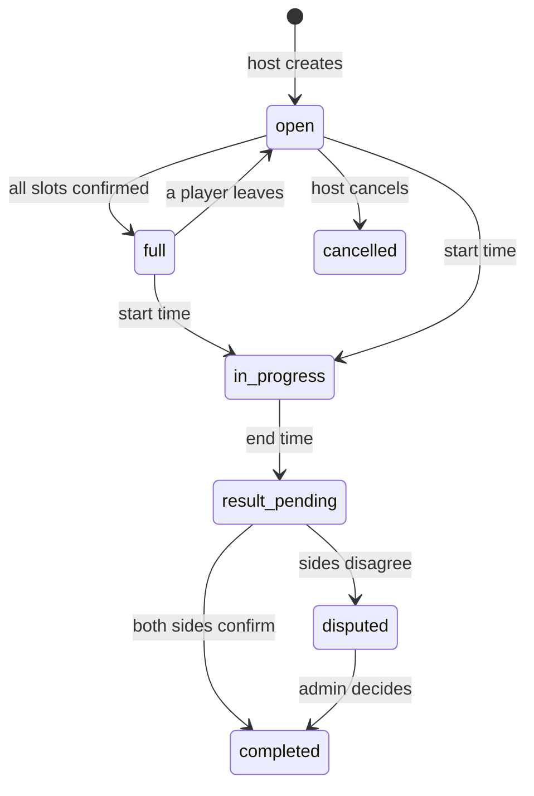
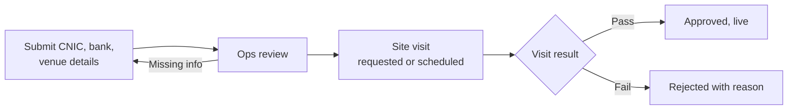

# SportsLink: Technical Specification

Sep 25, 2026 · @Affan

Source: `SportsLink Technical Specification.pdf` in this folder. If the two differ, the PDF is the original.

## 1. Purpose, scope and phases

This spec tells the tech team what to build for SportsLink: one mobile app (iOS and Android) and one web app for players and vendors, plus a separate web admin panel. Business rules come from the SportsLink Company Foundation Document. Where a decision is still open, it is marked **OPEN** and the team should build it as a configurable setting, not hard-code it.

### Build principles

- One account, two modes: Player and Vendor. Admin is a separate app with separate login.
- Multi-country ready: currency, timezone, language, payment methods and commission rules stored per country.
- Every business rule that may change (commission, hold times, billing deadlines, radius limits) is an admin setting.
- No card data or player money passes through SportsLink servers in the current model.

### Phases

| Phase          | Scope                                                                                                                                                                                       |
| -------------- | ------------------------------------------------------------------------------------------------------------------------------------------------------------------------------------------- |
| 1. Launch      | Auth and verification, profiles, vendor onboarding, venues and courts, booking with advance and split bills, manual bookings, create and join match, chat, vendor billing, core admin panel |
| 2. Growth      | Find Players live, skill rating (Glicko-2), behaviour reviews, teams, leaderboards, vendor analytics, subscriptions, ads, promo codes                                                       |
| 3. Tournaments | Tournament management, brackets, results, tournament rating, detailed stats                                                                                                                 |
| 4. Future      | Government trials, marketplace, add-ons, new countries                                                                                                                                      |

The data model in section 4 covers all phases so later phases do not need a rebuild.

## 2. Recommended tech stack

One language (TypeScript) across mobile, web, admin and backend, so a small team can move fast and share code. Versions should be the current stable ones when work starts.

| Layer                       | Recommendation                                             | Why                                                                        |
| --------------------------- | ---------------------------------------------------------- | -------------------------------------------------------------------------- |
| Mobile app                  | React Native with Expo                                     | One codebase for iOS and Android, over-the-air updates                     |
| Web app (player and vendor) | Next.js (React)                                            | Shares components and logic with mobile, good SEO for venue pages          |
| Admin panel                 | Next.js, separate deployment                               | Isolated from the public app for security                                  |
| Backend API                 | Node.js with NestJS                                        | Structured modules, strong typing, easy to test                            |
| Database                    | PostgreSQL with PostGIS                                    | Reliable transactions for bookings, fast distance queries for Find Players |
| Cache, locks, queues        | Redis with BullMQ                                          | Slot holds, rate limits, background jobs                                   |
| Realtime                    | Socket.IO on the backend, Redis adapter                    | Chat, live Find Players, live booking updates                              |
| Search                      | PostgreSQL full text at launch, OpenSearch later if needed | Keep launch simple                                                         |
| File storage                | S3-compatible storage with signed URLs                     | CNIC images private, venue photos public via CDN                           |
| Push notifications          | Firebase Cloud Messaging (Android and iOS via APNs)        | Standard and free                                                          |
| SMS OTP                     | A Pakistan SMS provider with a fallback provider           | Local delivery rates are better. **OPEN**: provider choice                 |
| Maps                        | Google Maps Platform                                       | Best coverage in Pakistan. Watch cost limits                               |
| Hosting                     | AWS, nearest region to Pakistan (Bahrain or Mumbai)        | **OPEN**: confirm data residency rules with the lawyer                     |
| Monitoring                  | Sentry for errors, CloudWatch or Grafana for metrics       | Catch problems before users report them                                    |
| CI/CD                       | GitHub Actions, Expo EAS for app builds                    | Automated tests and releases                                               |

Monorepo (for example Turborepo) with shared packages for types, validation schemas, API client and UI components.

## 3. System architecture

A modular monolith at launch: one backend with clear internal modules, split into services only when load requires it.

Backend modules: auth, users, verification, venues, bookings, payments, billing, matches, find-players, chat, ratings, teams, tournaments, notifications, moderation, ads, subscriptions, admin, audit.

## 4. Core data model

Main tables and their key fields. All tables have id (UUID), created_at, updated_at, and soft delete where records must be kept for audit. Money is stored as integer minor units with a currency code.

| Entity                     | Key fields                                                                                                                                  | Notes                                                 |
| -------------------------- | ------------------------------------------------------------------------------------------------------------------------------------------- | ----------------------------------------------------- |
| country                    | code, currency, timezone, languages, enabled_payment_methods                                                                                | Expansion ready                                       |
| user                       | phone, name, dob, gender, city, photo, status, is_minor, guardian_user_id                                                                   | One user can be player and vendor                     |
| verification               | user_id, doc_type (CNIC, B-Form), front_url, back_url, status, reviewer_id                                                                  | Images private, encrypted                             |
| player_sport               | user_id, sport_id, position, self_level, available_now, alert_mode                                                                          | alert_mode: always or only_when_available             |
| sport                      | name, team_size_min, team_size_max, stat_schema                                                                                             | stat_schema defines detailed stats per sport          |
| vendor                     | owner_user_id, business_name, billing_model, commission_rate, monthly_fee, credit_balance, status                                           | billing_model: percentage or monthly                  |
| vendor_staff               | vendor_id, user_id, branch_ids, permissions                                                                                                 | Limited access                                        |
| branch                     | vendor_id, name, address, location (geography point), status                                                                                | Multiple per vendor                                   |
| court                      | branch_id, sport_ids, name, surface, photos, slot_minutes, status                                                                           | A court or ground                                     |
| price_rule                 | court_id, day_type, start_time, end_time, price                                                                                             | Peak, off-peak, weekend, holiday                      |
| venue_policy               | branch_id, advance_type, advance_value, cancel_refund, noshow_refund, cancel_window_hours, recurring_allowed                                | Vendor controlled                                     |
| payment_account            | vendor_id, method, account_title, account_number, status, approved_by                                                                       | Admin approval required                               |
| site_visit                 | branch_id, requested_by, scheduled_at, visitor_admin_id, result, notes, photos                                                              | Required for approval                                 |
| booking                    | court_id, start_at, end_at, source (app, manual), status, total, advance_due, created_by, match_id, recurring_series_id, counts_for_billing | See section 6                                         |
| booking_share              | booking_id, user_id, amount, status, txn_reference, confirmed_by                                                                            | Per-player bill                                       |
| recurring_series           | court_id, weekday, start_time, weeks, status                                                                                                | All weeks paid upfront                                |
| match                      | host_id, sport_id, booking_id or unlisted_venue, start_at, slots_total, slots_filled, filters, visibility, status                           | See section 8                                         |
| match_player               | match_id, user_id, team_side, status, paid_by                                                                                               | status: requested, approved, confirmed, removed, left |
| player_request             | user_id, sport_id, location, radius_km, players_needed, window, filters, status, expires_at                                                 | Find Players                                          |
| conversation, message      | type, members, body, media, flagged_phone                                                                                                   | Chat                                                  |
| result                     | match_id, submitted_by, scores, status, confirmed_by, dispute_id                                                                            | Both sides confirm                                    |
| rating                     | user_id or team_id, sport_id, kind (skill, tournament), value, deviation, volatility, games                                                 | Glicko-2 fields                                       |
| review                     | match_id, from_user, to_user, stars, tags, comment                                                                                          | Behaviour only                                        |
| team, team_member          | sport_id, captain_id, members, role                                                                                                         | Team rating                                           |
| tournament, fixture, entry | format, sport, fee, prize, status, bracket, results                                                                                         | Admin only                                            |
| invoice, invoice_line      | vendor_id, period, lines, amount, status, due_at, paid_at                                                                                   | Monthly billing                                       |
| credit_txn                 | vendor_id, type (topup, deduction, adjustment), amount, booking_id                                                                          | If prepaid credit is chosen                           |
| report, moderation_action  | target, reason, status, action, admin_id                                                                                                    | Trust and safety                                      |
| audit_log                  | actor_id, role, action, target, before, after, ip                                                                                           | Append only                                           |
| setting                    | key, value, country_code                                                                                                                    | All admin configurable rules                          |

## 5. Auth, verification and accounts

**Sign-up:** phone number, OTP, then profile. Sessions use short-lived access tokens and rotating refresh tokens, stored in secure device storage.

**Verification:** user uploads CNIC front and back (minors: B-Form, plus guardian link). Status goes pending, approved or rejected with a reason. **OPEN**: whether CNIC is required at sign-up or only before creating, joining or using Find Players. Build it as a setting.

**Minors:** date of birth decides minor status. A minor account stays locked until a guardian with an approved CNIC accepts consent in their own account. Consent text version and timestamp are stored. Minor safeguards from the Foundation Document section 10.2 are feature flags, pending your decision.

**Mode switch:** a user becomes a vendor by submitting a vendor application. The app shows a Player or Vendor switch once approved. Staff accounts only see the vendor branches and actions granted to them.

**Edge cases**

- OTP: 60 second resend timer, 5 attempts then 30 minute lockout, rate limit per phone and per device.
- Phone number change: OTP on both old and new numbers, or admin review if old number is lost.
- Same CNIC on two accounts: block the second and flag for moderation.
- Banned users: device and CNIC are recorded so a new phone number cannot create a fresh account.
- Minor turns 18: guardian link ends automatically, user is asked to verify with CNIC.
- Account deletion: personal data removed, bookings, invoices and audit records kept anonymised.

## 6. Booking engine

Double booking must be impossible. App bookings, manual bookings, maintenance blocks and recurring series all live in the same booking table, protected by a database exclusion constraint on court and time range, plus a Redis lock during checkout.

### 6.1 Booking states

Manual bookings by the vendor go straight to confirmed.

### 6.2 Rules

- Hold time and payment confirmation time are settings (suggested 15 and 60 minutes).
- Slot price is calculated from price rules at booking time and stored on the booking, so later price changes do not affect it.
- Advance is set by venue policy: fixed amount or percentage.
- Recurring booking: only if the venue allows it. All weeks are created and checked together. If any week clashes, the player sees which ones and can skip them or cancel.
- Times are stored in UTC and shown in the venue's timezone.

### 6.3 Edge cases

- Two players select the same slot at once: the lock gives it to the first, the second sees it taken immediately.
- Vendor blocks a court for maintenance over existing bookings: not allowed until those bookings are moved or cancelled with notice.
- Vendor changes opening hours: existing bookings stay, new slots follow new hours.
- Venue suspended or banned: future bookings are flagged, players notified, refunds follow admin instruction.
- Vendor cancels a confirmed booking: player gets a full refund regardless of policy (recommended rule, **OPEN**), and the cancellation counts against the venue's reliability.
- Player cancels: refund follows the policy shown at booking time, even if the vendor changes it later.
- Vendor never confirms payment: booking expires, player is notified, support ticket opened automatically if a transaction ID was entered.
- Rain or closure: vendor can mark a slot cancelled by venue, which triggers the vendor cancel rule above.
- Player wants to extend: only if the next slot on the same court is free, charged as a new linked booking.

## 7. Payments and vendor billing

Players pay the vendor directly. SportsLink stores payment references and confirmations only, never card or wallet credentials.

### 7.1 Payment flow

- Cash at venue: booking confirmed only if the venue allows unpaid bookings. Otherwise an advance is required.
- Duplicate transaction IDs across bookings are rejected and flagged.
- A vendor rejecting a submitted payment opens a dispute automatically.

### 7.2 Split bills

- A booking has one share per paying player. The host's share covers the players they brought.
- Joining players get their own share when approved.
- Booking is confirmed when the confirmed shares cover the advance.
- Unpaid share after its deadline: the host is notified and can remove and replace that player.

### 7.3 Refunds

- Refund amount calculated from the policy stored on the booking.
- Vendor sends the refund directly, marks it sent with a reference. Player confirms received or raises a dispute.

### 7.4 Vendor billing

- `counts_for_billing` is true for app bookings and for manual bookings (rate for manual bookings **OPEN**).
- Percentage model: commission = rate × booking total, on completed bookings (and no-shows, **OPEN**).
- Monthly plan: fixed fee per vendor, set by admin.
- Invoice job runs on the 1st of each month in the venue's timezone. Invoice is immutable once issued; corrections are credit notes.
- Overdue ladder, all settings: reminder at 7 days, warning at 14, hidden from search at 21, blocked at 30.
- Vendor pays by bank transfer or wallet to SportsLink and uploads proof. Finance marks it paid.
- **If prepaid credit is chosen (OPEN):** commission is deducted from `credit_balance` when a booking is confirmed. At zero, new app bookings pause. Refunded bookings return the commission to credit.

### 7.5 Subscriptions

- Player ad-free subscription through Apple and Google in-app purchases on mobile, and a web payment provider on web. Entitlements are stored server side and synced from store notifications.

## 8. Matches

A match links a host, a sport, a time and either a booking at a listed venue or an unlisted venue address. The host approves every join request.

### 8.1 Rules

- Host sets slots_total and players already confirmed. Joiners fill the rest.
- Filters: skill rating range, age range, gender, verified only. Players outside the filters cannot see or request the match.
- Join request states: requested, approved, confirmed (share paid), declined, withdrawn, removed.
- Approval deadline: requests not answered before a cut-off (setting, for example 2 hours before start) expire.
- Unlisted venue: show the warning screen every time before creating or joining. No booking or payment is created.

### 8.2 Edge cases

- Host cancels: every confirmed player is notified. Refunds follow the booking policy. Frequent cancelling lowers host reliability.
- Host leaves but others want to play: host can transfer the host role to a confirmed player.
- Player leaves after paying: refund follows policy. Slot reopens and the host is notified.
- More approvals than slots: the system blocks approval once slots are full, remaining requests go to a waitlist.
- Player joins two matches at overlapping times: warn and block.
- Player blocked by the host: cannot see that host's future matches.
- Nobody joins: host is reminded before the payment deadline and can cancel without penalty (window is a setting).
- Match at an unlisted venue with a reported safety issue: moderation can hide all matches at that address.

## 9. Find Players (live)

A player broadcasts a request, nearby matching players get a push notification, they accept, and the requester picks who joins. Everything after that moves to a chat.

### 9.1 Flow

1. Requester sets sport, players needed, radius, time window (now, today, custom) and filters.
2. Backend queries players with that sport whose last known location is inside the radius (PostGIS `ST_DWithin`), who match the filters, and whose alert mode allows it.
3. Notifications go out in batches, nearest first, so the requester is not flooded.
4. Accepting players appear to the requester live over WebSocket with rating, reliability and approximate distance.
5. Requester selects players. A group chat opens. Unselected players are told politely.
6. In chat they agree venue and time, then convert the request into a match (listed venue booking or unlisted venue).

### 9.2 Location

- Location is sent only while the app is open, or in the background if the user turns on Available to play. Precise location is never stored long term, only a rounded location (about 500 m) for matching.
- Other users only see distance bands (for example under 2 km, 2 to 5 km), never coordinates.

### 9.3 Limits and edge cases

- Radius: user chosen, capped by a setting (for example 1 to 25 km).
- Rate limits: requests per user per hour, and alerts received per user per day (settings).
- Quiet hours: no alerts at night unless the user allows it.
- Request expires at the end of its window, or when the requester closes it.
- Requester cancels after selecting players: chat stays open briefly, players notified.
- Selected player goes silent: requester can remove them and pick another from the accepted list.
- Nobody nearby: suggest widening the radius, or show open matches nearby.
- Minor safeguards apply here (Foundation Document 10.2, feature flagged).

## 10. Chat

Chat supports one-to-one and group conversations tied to matches, teams, Find Players requests and bookings (player to vendor).

- Message types: text, photo, voice note, location pin, system message (for example "Ali joined the match").
- Delivery over WebSocket with push fallback. Read receipts and typing indicator.
- Messages stored server side so moderators can review reported conversations. Not end-to-end encrypted, which is needed for moderation. State this in the privacy policy.
- **Phone number detection:** detect Pakistani number patterns (for example 03xx xxxxxxx, +92), including spaced or written-out digits. Show a safety warning, then send only if the user confirms. Log the event.
- Media: size limits, image compression, malware scanning on upload.
- Block: blocked users cannot message or see each other's activity.
- Report: reporter picks a reason, the last messages are attached to the report automatically.
- Retention: group chats stay readable for a set period after the match (setting), then archive.
- Minor accounts: private chat rules follow the minor safeguards feature flags.

## 11. Ratings, results and disputes

Skill ratings use Glicko-2, one rating per user per sport, and one per team per sport. Tournament ratings are a separate `kind` updated only from admin-entered tournament results.

### 11.1 Result flow

1. After the match ends, any confirmed participant submits the result (winner, draw, scores, optional detailed stats).
2. The other side confirms or disputes within 48 hours (setting). Silence after the deadline counts as confirmed, **OPEN**.
3. Dispute: both sides add a note, admin decides, decision is final and logged.
4. Only completed matches with check-in or both-side confirmation update ratings.

### 11.2 Glicko-2 settings

- Start rating 1500, rating deviation 350, volatility 0.06, system constant tau 0.5. All configurable.
- Rating period: process each result as it completes (a period of one game), which is common for apps.
- Deviation grows slowly when a player is inactive, so returning players' ratings adjust faster.
- Library: use a well-tested open source Glicko-2 implementation, wrapped with unit tests from the published example in Glickman's paper.

### 11.3 Team sports

- Each side gets a composite rating: mean of member ratings, deviation combined from member deviations.
- Each player is updated as if they played one game against the other side's composite.
- Team entities (section 12) get their own rating updated the normal way.

### 11.4 Anti-abuse

- Repeat opponents: after N games against the same people in a period, rating change is reduced (setting).
- Rating changes are held until the confirmation window closes.
- Admin can void a match and recalculate affected ratings.

### 11.5 Tiers and leaderboards

- Tiers mapped from rating bands (for example Bronze, Silver, Gold, Platinum, Elite). Bands are a setting.
- Players with high deviation show as "Provisional" and are hidden from leaderboards until they settle.
- Leaderboards per sport, computed by a scheduled job and cached.

### 11.6 Behaviour reviews

- Allowed only between confirmed participants, once per pair per match, within 48 hours.
- Stars (1 to 5) plus tags. Shown as an average and top badges. Never affect skill rating.

## 12. Teams and tournaments

### 12.1 Teams

- Created by a player for one sport. Captain invites members, members accept.
- Roles: captain, vice captain, member. Captain can transfer the role.
- Team page: roster, team rating, match history, tournament history.
- Team matches: a team creates a match against another team, or opens it for any team to challenge.
- Edge cases: member leaves mid-tournament (roster locked after registration closes, admin can approve changes), captain banned (vice captain takes over, else admin assigns).

### 12.2 Tournaments (admin only)

- Admin sets sport, format, individual or team entry, entry fee, prize, venue, dates, eligibility (rating range, age, gender), max entries and registration deadline.
- Formats: knockout, league, round robin, groups then knockout. Bracket generation with seeding by tournament rating, random for unrated.
- Registration: player or captain registers and pays the fee. **OPEN**: fee paid to SportsLink or to the host venue, given the no-holding-money model.
- Fixtures, live standings and results entered by admin. Walkovers and withdrawals handled by admin.
- Tournament rating updated from official results only.
- Government trials: a placeholder screen marked Coming soon. Data model keeps a `programme` field on tournaments for future trials.

## 13. Vendor module

Available in the same mobile app (Vendor mode) and on web, where the calendar and analytics are easier to use.

### 13.1 Onboarding

Bank account title must match the CNIC name. Ownership or lease document is optional. Any later change to payment accounts goes back to admin approval, and the old account stays active until the new one is approved.

### 13.2 Features

- Branch, court and price rule management, photo gallery, facilities, rules.
- Policies: advance, cancellation refund, no-show refund, cancel window, recurring allowed.
- Calendar per branch and court, day and week views, drag to block time.
- Manual booking with customer name and optional phone (stored privately, never shown to players).
- Payment confirmation queue, no-show marking, refund recording.
- Staff management with permissions: view bookings, create bookings, confirm payments, edit prices, view revenue, manage staff. Scoped by branch.
- Analytics: bookings, occupancy heatmap by hour, revenue by court and source, cancellations, rating trend, reviews with reply.
- Revenue calculator: projected revenue from price rules and occupancy.
- Billing: current month running total, invoices, payment upload, credit balance if prepaid is chosen.

### 13.3 Edge cases

- Vendor deletes a court with future bookings: blocked until those bookings are resolved.
- Vendor price change: applies only to new bookings.
- Staff removed: sessions revoked immediately.
- Vendor blocked for non-payment: listings hidden, existing confirmed bookings still honoured and visible to the vendor.

## 14. Admin panel and permissions

Separate web app, separate domain, admin login with password plus mandatory two-factor authentication. Optional IP allow-list.

| Permission area              | Owner | Super admin       | Operations  | Finance          | Moderation |
| ---------------------------- | ----- | ----------------- | ----------- | ---------------- | ---------- |
| Manage admins and roles      | Yes   | Yes, except Owner | No          | No               | No         |
| Venue approval, site visits  | Yes   | Yes               | Yes         | No               | No         |
| Payment account approval     | Yes   | Yes               | Yes         | Yes              | No         |
| Commission, plans, invoices  | Yes   | Yes               | View        | Yes              | No         |
| Player verification          | Yes   | Yes               | Yes         | No               | Yes        |
| Bans and suspensions         | Yes   | Yes               | Venues only | No               | Yes        |
| Reported chats and reviews   | Yes   | Yes               | No          | No               | Yes        |
| Disputes (results, bookings) | Yes   | Yes               | Yes         | Refund disputes  | Yes        |
| Tournaments                  | Yes   | Yes               | Yes         | Fees view        | No         |
| Promo codes, campaigns, ads  | Yes   | Yes               | Yes         | View             | No         |
| Analytics                    | Yes   | Yes               | Operational | Financial        | Safety     |
| Settings and feature flags   | Yes   | Yes               | No          | Billing settings | No         |

Permissions are stored as granular actions, so roles can be adjusted later without code changes.

**Requirements**

- Every admin action writes to the append-only audit log with before and after values.
- Reading a private chat or CNIC image is itself logged.
- Bans need a reason and optional expiry. Ban types: warning, temporary suspension, permanent ban, shadow limit on Find Players.
- Auto flags into queues: venue rating below a threshold, many no-shows, many reports, duplicate CNIC, payment account changes.
- Dashboards: bookings, commission due and collected, outstanding invoices, active users, new venues, top sports, city breakdown.

## 15. Notifications

All notifications go through one notification service with templates per language, user preferences, quiet hours and delivery logs.

| Event                                           | Player      | Vendor      | Channel                             |
| ----------------------------------------------- | ----------- | ----------- | ----------------------------------- |
| Booking held, confirmed, cancelled, reminder    | Yes         | Yes         | Push, in-app                        |
| Payment submitted, confirmed, rejected          | Yes         | Yes         | Push, in-app                        |
| Match join request, approved, declined, removed | Yes         | No          | Push, in-app                        |
| Find Players nearby request                     | Yes         | No          | Push                                |
| New chat message                                | Yes         | Yes         | Push, in-app                        |
| Result to confirm, dispute update               | Yes         | No          | Push, in-app                        |
| Review received                                 | Yes         | Yes         | In-app                              |
| Invoice issued, reminder, overdue, blocked      | No          | Yes         | Push, in-app, SMS for final warning |
| Verification approved or rejected               | Yes         | Yes         | Push, SMS                           |
| Minor activity (guardian)                       | Guardian    | No          | Push                                |
| Tournament updates                              | Yes         | No          | Push, in-app                        |
| Marketing campaigns                             | Opt-in only | Opt-in only | Push                                |

## 16. Security and privacy

- **Secrets:** never in code or the repo. Use a secrets manager (for example AWS Secrets Manager). Secret scanning in CI.
- **Encryption:** TLS everywhere. Database and file storage encrypted at rest. CNIC images and numbers encrypted at field level with separate keys.
- **Access to sensitive data:** CNIC images served only through short-lived signed URLs to admins with permission. Every view is logged.
- **Phone numbers:** never returned by any player-facing API.
- **Location:** rounded before storage, never exposed as coordinates to other users.
- **API protection:** rate limiting per IP, user and device. Input validation with shared schemas. Protection against the OWASP Top 10.
- **Authorisation:** every endpoint checks ownership or role. Vendor staff scoped to their branches. Tests for access rules on every endpoint.
- **Fraud signals:** duplicate CNIC, duplicate device, duplicate transaction IDs, unusual rating gains, sudden payment account changes.
- **Backups:** daily automated backups, point in time recovery, restore tested every quarter.
- **Privacy:** privacy policy covering CNIC, location, chat storage and ads. Data export and deletion on request.
- **Penetration test** before public launch.

## 17. Non-functional requirements

Targets for launch. They should be revisited once real usage data exists.

| Area                        | Target                                                                                               |
| --------------------------- | ---------------------------------------------------------------------------------------------------- |
| API response time           | 95% of requests under 300 ms                                                                         |
| Slot availability accuracy  | Zero double bookings, verified by concurrency tests                                                  |
| Find Players alert delivery | First alerts sent within 5 seconds of a request                                                      |
| Chat delivery               | Under 1 second when both users are online                                                            |
| Uptime                      | 99.5% monthly at launch                                                                              |
| App performance             | Cold start under 3 seconds on a mid-range Android phone                                              |
| Network                     | Usable on slow 3G, with retries and offline states                                                   |
| Devices                     | Android 8 and later, iOS 15 and later, latest two versions of major browsers (confirm when starting) |
| Accessibility               | Readable text sizes, sufficient contrast, screen reader labels                                       |
| Localisation                | English at launch, structure ready for Urdu with right-to-left layout (**OPEN**)                     |
| Scalability                 | Launch city load, designed to scale horizontally for national rollout                                |

## 18. Delivery

Phase 1 is about 10 to 12 weeks with the team below, including 2 weeks of design and setup. A 6-week target is only possible for a cut-down pilot (Foundation Document section 12). Estimates are approximate.

### 18.1 Suggested team

| Role                            | Count                      | Focus                                            |
| ------------------------------- | -------------------------- | ------------------------------------------------ |
| Tech lead / backend             | 1                          | Architecture, booking engine, billing            |
| Backend developer               | 1                          | Matches, chat, notifications, admin APIs         |
| Mobile developer (React Native) | 1 to 2                     | Player and vendor app                            |
| Web developer (Next.js)         | 1                          | Web app and admin panel                          |
| UI/UX designer                  | 1 (part time after week 3) | Flows, designs, design system                    |
| QA engineer                     | 1                          | Test plans, concurrency and payment flow testing |

### 18.2 Environments

- Local, development, staging (production-like data volumes, fake data only), production.
- No real CNIC images, phone numbers or payment details outside production.

### 18.3 Testing

- Unit tests for pricing, commission, billing, Glicko-2 and permissions.
- Integration tests for booking, split payment and match flows.
- Concurrency tests for double-booking prevention.
- End-to-end tests for main journeys on Android, iOS and web.
- Linting and type checks block merges. Test failures are reported, never skipped.

### 18.4 Phase 1 done means

- [ ] A player can sign up, verify, find a venue, book with split payment and get confirmation.
- [ ] A vendor can apply, pass a site visit, list courts with prices, and see app and manual bookings in one calendar.
- [ ] A host can create a match, approve players, and each player pays their share.
- [ ] Players can chat, with the phone number warning working.
- [ ] Admin can approve venues and payment accounts, ban users, set commission per vendor and issue monthly invoices.
- [ ] No double booking under concurrency testing.
- [ ] Security checklist and penetration test passed.

## 19. Open technical questions

Build each as a setting or feature flag until decided.

- [ ] Billing model: postpaid invoices, prepaid vendor credit, or collecting the advance through a licensed gateway?
- [ ] Commission rate on manual bookings and on no-shows?
- [ ] Does silence after the result window count as confirmation?
- [ ] Vendor cancellation: always a full refund to the player?
- [ ] CNIC required at sign-up or only before creating, joining or Find Players?
- [ ] Which minor safeguards are switched on?
- [ ] Tournament fees: paid to SportsLink or to the venue?
- [ ] SMS OTP provider and backup provider?
- [ ] Hosting region, once data residency is confirmed by the lawyer?
- [ ] Urdu at launch or later?
- [ ] Launch sports list and launch city?
- [ ] Ad network or direct sponsor ads only?
